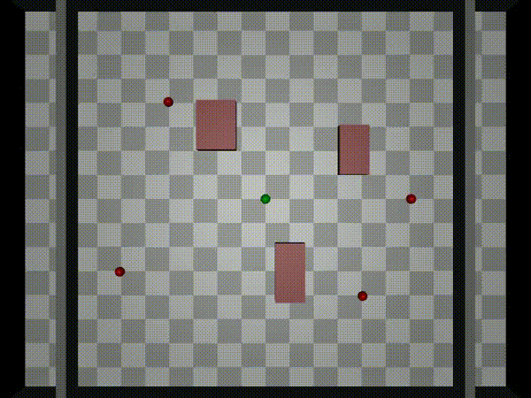

# 🧠 APEX: Physical  Framework

> 🚀 A modular decision-making framework combining graph-based physical perception with LLM-driven reasoning, tested in dynamic and uncertain environments like obstacle avoidance and Tetris!

---

## 🎬 Visual Demo

### 🧱 Tetris with LLM Planning

| gpt-4o-mini                            | gpt-4o                            | VLM                            | APEX(gpt-4o)                           |
|----------------------------------------|-----------------------------------|--------------------------------|----------------------------------------|
|  |  |  |  |

---

### 🐱 Robot-Cat Avoidance Simulation
gpt-4o-mini



gpt-4o


VLM


APEX(gpt-4o-mini)


APEX(gpt-4o)


---

## 🌌 Overview
APEX is a hybrid framework designed for reasoning and decision-making under uncertainty. It uses a Graphormer model to capture potential physical interactions and a language model (LLM) to interpret simulation results and generate high-level strategies.

### 📦 Key Components
- **Graphormer Trigger**: Detects potential physical hazards by computing edge-level attention scores.
- **Physical Simulator**: Predicts action outcomes under current physics.
- **LLM Planner**: Uses simulation summaries to suggest safe and effective actions.

---

## 🧪 Experiments

### Physical Questions
- Ask LLM to answer physical questions without using python.

### 🧱 Tetris LLM Planning
- Predicts optimal block placement
- Avoids overflow & line gaps using reasoning

### ✅ Cat Avoidance Task
- Difficulty levels: `Simple`, `Medium`, `Hard`
- Metrics:
  - **CFR**: Collision-Free Rate
  - **IAR**: Invalid Action Rate
  - **AST**: Average Survival Time

---

## 🛠 Setup
```bash
conda create -n apex python=3.11
conda activate apex
```

---

## 📈 Citation
If you find this work helpful, please cite our paper💡
```bibtex
@misc{huang2025apexempoweringllmsphysicsbased,
      title={APEX: Empowering LLMs with Physics-Based Task Planning for Real-time Insight}, 
      author={Wanjing Huang and Weixiang Yan and Zhen Zhang and Ambuj Singh},
      year={2025},
      eprint={2505.13921},
      archivePrefix={arXiv},
      primaryClass={cs.RO},
      url={https://arxiv.org/abs/2505.13921}, 
}
```

