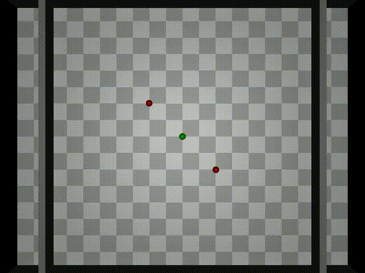
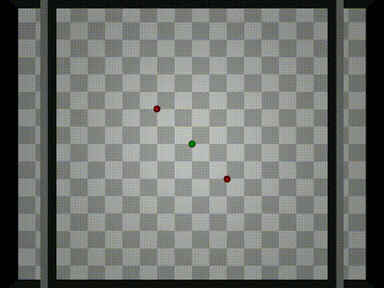

# 🧠 APEX: Attention-Powered EXecutive Framework

> 🚀 A modular decision-making framework combining graph-based physical perception with LLM-driven reasoning, tested in dynamic and uncertain environments like obstacle avoidance and Tetris!

---

## 🎬 Visual Demo

### 🧱 Tetris with LLM Planning

| gpt-4o-mini                            | gpt-4o                            | VLM                            | APEX                            |
|----------------------------------------|-----------------------------------|--------------------------------|---------------------------------|
|  |  |  |  |

---

### 🐱 Robot-Cat Avoidance Simulation
gpt-4o-mini



gpt-4o


APEX(gpt-4o-mini)


APEX(gpt-4o)



---

## 🌌 Overview
APEX is a hybrid framework designed for reasoning and decision-making under uncertainty. It uses a Graphormer model to capture potential physical interactions and a language model (LLM) to interpret simulation results and generate high-level strategies.

### 📦 Key Components
- **Graphormer Trigger**: Detects potential physical hazards by computing edge-level attention scores.
- **Physical Simulator**: Predicts action outcomes under current physics.
- **LLM Planner**: Uses simulation summaries to suggest safe and effective actions.

---

## 🧪 Experiments

### ✅ Cat Avoidance Task
- Difficulty levels: `Simple`, `Medium`, `Hard`
- Metrics:
  - **CFR**: Collision-Free Rate
  - **IAR**: Invalid Action Rate
  - **AST**: Average Survival Time

### 🧱 Tetris LLM Planning
- Predicts optimal block placement
- Avoids overflow & line gaps using reasoning

---

## 🗂 Project Structure
```
PGD
├── experiments
│   ├── cat_exp
│   │   ├── env
│   │   ├── model
│   │   ├── utils
│   │   └── visualization
│   ├── physical_question_exp
│   ├── tetris_exp
│   └── __pycache__
├── media
└── README.md
```

---

## 🛠 Setup
```bash
conda create -n apex python=3.10
pip install -r requirements.txt
```

---

## 📈 Citation (coming soon)

If you find this work helpful, please stay tuned for the arXiv/NIPS version 💡

